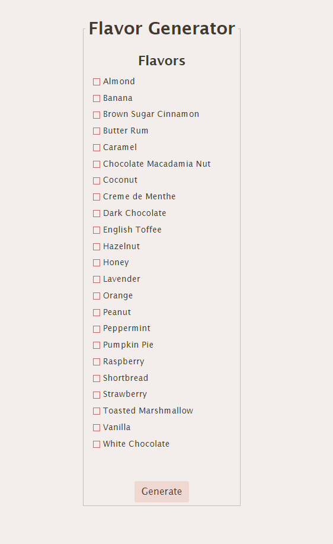
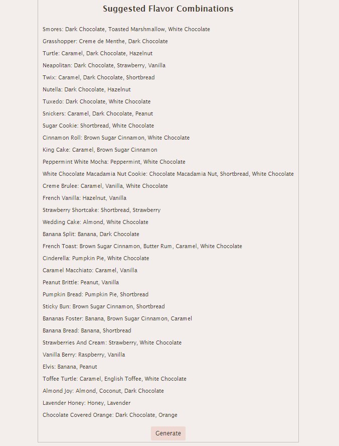

# Flavor Generator
>Olivia A. Baton Rouge, Louisiana, USA
#### Video Demo: https://youtu.be/uP7ErC_12Wg
#### Project Description:

I have been a barista for years, and one thing that has always stood out to me is that coffee shop menus are not the best. Flavors are listed, but guests have difficulty in picking combinations that sound appealing.
I have created an application that will list coffee flavor combinations given user selection of favorite flavors (or what the coffee shop offers).
Combining all aspects of week 8, and wanting to challenge myself, I decided to use REACT to create a Flavor Generator.

In the Flavor.jsx file I have listed an array of common flavors available at coffee shops.
The Combinations.jsx file lists combinations of flavors that I have come across as a basista over the years.
In the FlavorTest.jsx file, I used an array map to list the flavors next to check boxes and created he function, Flavor to set selected checkboxes as checked or !checked.
To create the comparison and list results, I created a file called Generate.jsx. The Generate function handles the submission of the form and completes the comparison between selected flavors and the combination array.
It was difficult to find a way to print the flavor combination after the user selected flavors and a comparison was made with the combinations, so I created another array that is housed in the CombinationList.jsx file. The combos array and comboList array are ordered identically so for the combination matched, the index of the combo is macthed with the index of the comboList and the name/recipe is printed.

The App.js file inclues the function App, that returns the FlavorTest and Generate files.

>This is a screenshot of the single flavors that the user is able to choose from.

>This is a screenshot of the flavor combinations that are generated if all of the single flavors are selected. 

#### Future Additions and Improvements
As of now, this is just a front end application, but I have plans to add milk type and drink type to ensure that the user is able to customize coffees, teas, smoothies (and more) to what the restaurant has to offer. I would also like to add a back end and allow the user to create a profile and like/save flavor combinations that they like, give suggestions on flavors and flavor combinations to add, and include more combinations!

The most dificult portion of this project was getting and using the checked flavors that the user clicked. I believe that adding a database would make this much easier later on.

